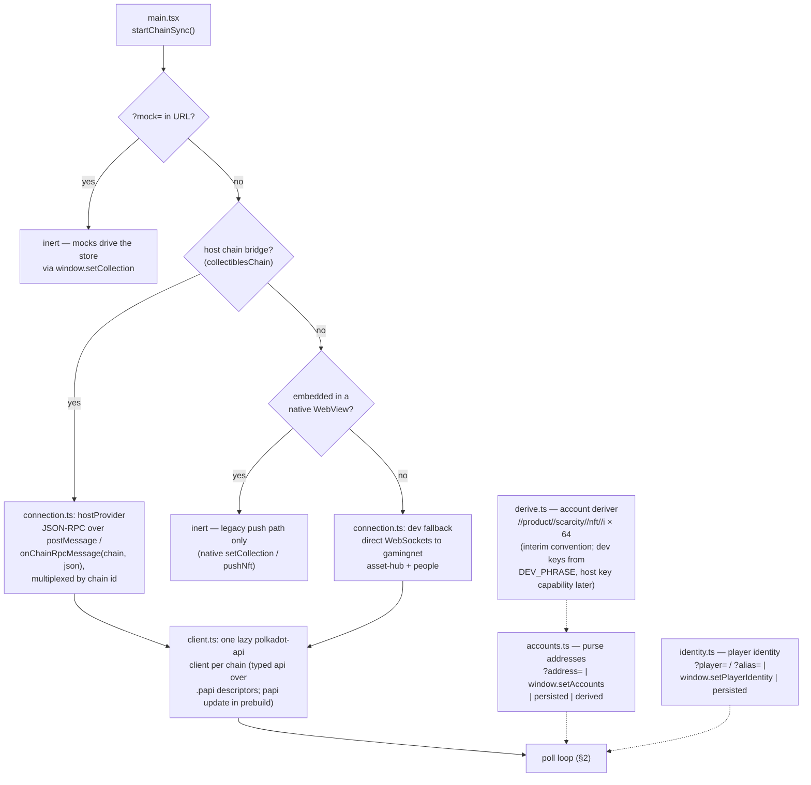

# How the read path works

How the webview assembles the shelf from chain data, as implemented in
`src/chain/`. Two views: where the data source comes from (once, at
startup), and what one poll cycle reads (repeating).

## 1. Startup: choosing the data source



The two dotted inputs are the open-platform-question seams: *which purse
addresses* belong to the player (derivation convention, dependency #5)
and *which identity* queries the credit map (account vs alias,
dependencies #2/#3). Both are subscriptions — a change restarts the poll.

## 2. One poll cycle (every 30 s, backoff on error)

```mermaid
sequenceDiagram
    participant ST as chain/start.ts
    participant SC as chain/pallets/scarcity.ts
    participant CR as chain/pallets/credits.ts
    participant AH as Asset Hub
    participant PC as People Chain
    participant CO as bridge/collection.ts
    participant UI as React (App.tsx)

    Note over ST: poll() — both chains in parallel

    par owned items (Asset Hub)
        ST->>SC: fetchOwned(addresses)
        SC->>AH: Scarcity.NftsByOwner.getValues([addr…])
        AH-->>SC: Nft { instance, collection, item, minted_at } per hit
        SC->>AH: metadata "hash" per instance<br/>(Instance → Item → Collection, first match;<br/>cached per instance after first resolve)
        AH-->>SC: 32-byte identity hash
        SC-->>ST: OwnedNft[] = { hash, mintedAt }
    and earned credits (People Chain, optional)
        ST->>CR: fetchCredits(identity)
        CR->>PC: NftCredits.NftClaimCreditBlocks(AccountOrPerson)<br/>+ api: NftCreditsApi.nft_claim_credit_roots(claimant)
        PC-->>CR: my award blocks | [(block, { root, timestamp, … })]
        CR->>PC: rooted blocks: api nft_claim_credit_proofs(block, claimant)
        PC-->>CR: proofs carrying each credit hash and leaf<br/>(cached for the Phase-2 claim flow)
        CR->>PC: rootless newest block: NftCredits.NftClaimCreditAwards(block)
        PC-->>CR: the block's award buffer, filtered to this claimant
        CR-->>ST: Credit[] = { hash, awardedAt?, awardBlock?, root?, leaf? }
    end

    Note over ST: fetchClaimStates() (chain/pallets/claims.ts, Asset Hub):<br/>NftClaims.CreditTrees(block) — root arrived?<br/>NftClaims.ClaimedCredits(block) — leaf claimed?

    Note over ST: mergeShelf():<br/>minted hash wins over same-hash credit;<br/>root not on Asset Hub → pending (wrapped/Earned);<br/>root there, leaf unclaimed → pending + claimable;<br/>leaf claimed elsewhere → withheld from the shelf.

    ST->>CO: deliverCollection({ owned })
    Note over CO: same store the native push bridge feeds:<br/>coerce → dedup by hash → generation bump<br/>only if the item SET changed
    CO->>CO: write-back localStorage cache
    CO-->>UI: snapshot → render shelf
    Note over UI: cache-first: shelf rendered from cache at boot,<br/>this delivery corrects it
```

## What each module owns

| Module | Owns |
|---|---|
| `chain/connection.ts` | where bytes come from: host bridge vs dev WS vs inert; chain multiplexing |
| `chain/client.ts` | one lazy polkadot-api client per chain; typed apis over generated descriptors (`.papi/whitelist.ts` bounds the generated package) |
| `chain/pallets/scarcity.ts` | Asset Hub reads: `NftsByOwner`, three-level `"hash"` metadata (vendored from the scarcity-tools SDK) |
| `chain/pallets/credits.ts` | People Chain reads: award blocks, roots, proofs, rootless awards buffer (proof cache for Phase 2) |
| `chain/pallets/claims.ts` | Asset Hub nft-claims reads: `CreditTrees` root arrival, `ClaimedCredits` claimed leaves → per-credit Earned/Claimable/claimed state |
| `chain/accounts.ts` | the purse-address seam (explicit sources win over the deriver) |
| `chain/derive.ts` | the account deriver: `//product//scarcity//nft//i` (interim convention, decided 2026-08-07, not platform-ratified) over a `KeyAtIndex` capability — dev impl derives from `DEV_PHRASE` in-page; production waits on the host's public-key-at-index API |
| `chain/identity.ts` | the player-identity seam |
| `chain/start.ts` | the loop: inputs → parallel fetch → mergeShelf → deliverCollection; errors → `flow.error phase=chain` + backoff |
| `bridge/collection.ts` | the single store both the chain sync and the native push feed |

## Not implemented yet (marked seams)

- **The purse convention is interim** (dependency #5) — `derive.ts`
  implements `//product//scarcity//nft//i` as our own decision pending
  platform ratification; only `pursePath()` changes if the rule changes.
  The host "public key at an index" capability has no implementation yet,
  so in-page dev derivation carries it.
- **Credit-hash == item-hash assumption** — merging assumes a minted
  item's `"hash"` metadata equals the credit hash.
- **Claiming/minting** (Phase 2) — proofs are already fetched and cached
  (`getCachedProof()` in `credits.ts`) and Claimable items are flagged
  (`OwnedNft.claimable`); `NftClaims.claim(block, credit, leaf_index,
  proof, collection, mint_to)` is live on the testnet Asset Hub, so what
  remains is the claim builder and the signing seam.
