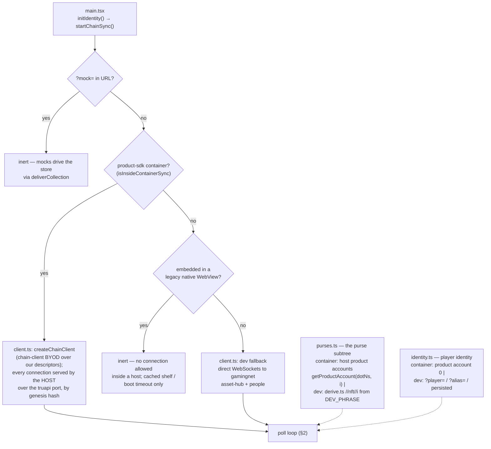

# How the read path works

How the webview assembles the shelf from chain data, as implemented in
`src/chain/`. Two views: where the data source comes from (once, at
startup), and what one poll cycle reads (repeating).

## 1. Startup: choosing the data source



The two dotted inputs are the open-platform-question seams: *which purse
addresses* belong to the player (product accounts by index vs the dev
`//nft//i` derivation — both sides of the mint/claim pipeline must agree,
dependency #5) and *which identity* queries the credit map (product
account 0 vs a person alias, dependencies #2/#3). Identity is a
subscription — a change restarts the poll.

## 2. One poll cycle (every 30 s, backoff on error)

```mermaid
sequenceDiagram
    participant ST as chain/start.ts
    participant SC as chain/pallets/scarcity.ts
    participant CR as chain/pallets/credits.ts
    participant AH as Asset Hub
    participant PC as People Chain
    participant CO as collection/store.ts
    participant UI as React (App.tsx)

    Note over ST: poll() — both chains in parallel

    par owned items (Asset Hub)
        ST->>SC: scanOwned(purseSource) → fetchOwnedAt(addresses)
        SC->>AH: Scarcity.NftsByOwner.getValues([addr…])
        AH-->>SC: Nft { instance, collection, item, minted_at } per hit
        SC->>AH: api ScarcityApi.metadata_batch([Instance(id)…])<br/>(ONE call, all three metadata layers per instance)
        AH-->>SC: hash/name/image pairs, resolved<br/>Instance → Item → Collection, most specific wins
        SC-->>ST: OwnedNft[] = { hash, mintedAt }
    and earned credits (People Chain, optional)
        ST->>CR: fetchCredits(identity)
        CR->>PC: NftCredits.NftClaimCreditBlocks(AccountOrPerson)<br/>+ api: NftCreditsApi.nft_claim_credit_roots(claimant)
        PC-->>CR: my award blocks | [(block, { root, timestamp, … })]
        CR->>PC: rooted blocks: api nft_claim_credit_proofs(block, claimant)
        PC-->>CR: proofs carrying each credit hash and leaf<br/>(cached for the Phase-2 claim flow)
        CR->>PC: rootless newest block: NftCredits.NftClaimCreditAwards(block)
        PC-->>CR: the block's award buffer, filtered to this claimant
        CR-->>ST: Credit[] = { hash, awardedAt?, awardBlock?, root?, leaf? }
    end

    Note over ST: fetchClaimStates() (chain/pallets/claims.ts, Asset Hub):<br/>NftClaims.CreditTrees(block) — root arrived?<br/>NftClaims.ClaimedCredits(block) — leaf claimed?

    Note over ST: mergeShelf():<br/>minted hash wins over same-hash credit;<br/>root not on Asset Hub → pending (wrapped/Earned);<br/>root there, leaf unclaimed → pending + claimable;<br/>leaf claimed → credit dropped, its item<br/>shows up via the scan on its own.

    ST->>CO: deliverCollection({ owned })
    Note over CO: the single store: coerce → dedup by hash →<br/>generation bump only if the item SET changed
    CO->>CO: write-back localStorage cache
    CO-->>UI: snapshot → render shelf
    Note over UI: cache-first: shelf rendered from cache at boot<br/>(only when the cache was saved under the same<br/>player identity), this delivery corrects it
```

## What each module owns

| Module | Owns |
|---|---|
| `chain/client.ts` | where bytes come from: product-sdk container (`createChainClient`, host-served by genesis hash; host without Asset Hub → retried failure + error state, sockets only under a `?player=` QA override) vs dev WS vs inert; teardown/rebuild for wedged connections |
| `chain/devClient.ts` | the dev connection path: direct testnet WebSockets, one lazy client per chain (`TESTNET_WS`) |
| `chain/product.ts` | the product's DotNS identifier (value pending team ratification) |
| `chain/purses.ts` | the purse-address seam: `PurseSource` — container impl asks the host for product accounts by index (memoized; capability PROBED — absent in today's hosts → dev impl stands in) |
| `chain/devPurses.ts` | the dev purse source: in-page DEV_PHRASE derivation over `derive.ts` |
| `chain/pallets/scarcity.ts` | Asset Hub reads: `NftsByOwner`, plus the generalized `metadata_batch` runtime call serving all three metadata layers (`"hash"`/`"name"`/`"image"`) for Instance / Item / Collection queries — the shelf per poll, and the mint flow's item/collection previews |
| `chain/pallets/credits.ts` | People Chain reads: award blocks, roots, proofs, rootless awards buffer; plus `fetchClaimProof` — the live inclusion proof for one credit at claim time |
| `chain/pallets/minters.ts` | Asset Hub read: the collections registered to accept claims (`NftClaims.CollectionMinters`) with names, the mint flow's collection picker |
| `chain/pallets/preview.ts` | Asset Hub read: `NftClaimsApi.preview_mints` — what a credit would mint into each collection (the blurred preview) |
| `chain/claim.ts` | builds/signs/watches `NftClaims.claim` — re-fetches the proof, mints into the first free purse, resolves on finality |
| `chain/signing.ts` / `devSigning.ts` | the signer seam: a `PolkadotSigner` for the claimant — the host signs as its product account (iOS/desktop implement it; gated on a registered DotNS id, dependency #1), with the dev DEV_PHRASE signer as the plain-browser/QA path and TEMPORARY stand-in |
| `chain/mint.ts` | the mint flow's UI-facing facade: load collections/previews, `claimCredit`, and whether the session can sign at all |
| `chain/pallets/claims.ts` | Asset Hub nft-claims reads: `CreditTrees` root arrival, `ClaimedCredits` claimed leaves → per-credit Earned/Claimable/claimed state |
| `chain/derive.ts` | the DEV-ONLY account deriver: `//nft//i` (the retreat web-demo's convention, adopted 2026-08-11 so both in-house minting surfaces share purses) from `DEV_PHRASE` in-page — inside a container, host product accounts replace it (purses.ts) |
| `chain/identity.ts` | the player-identity seam: type, validation gate, subscription; container → product account 0 via `initIdentity()` |
| `chain/devIdentity.ts` | the dev identity inputs: `?player=`/`?alias=` QA override, dev-name expansion, dev-session persistence |
| `chain/start.ts` | the loop: inputs → parallel fetch → mergeShelf → deliverCollection; errors → `flow.error phase=chain` + backoff. Also `claimCredit` (gathers connection/identity/signer/purse, submits, forces a refresh) and `refreshChainSync` (immediate re-poll) |
| `collection/store.ts` | the single store the chain sync (and dev mocks) feed |

## Not implemented yet (marked seams)

- **The purse convention is half-answered** (dependency #5) — inside a
  container the host's `getProductAccount(dotNs, i)` IS the
  public-key-at-index capability (purses.ts, since 2026-08-13); what
  remains open is ratifying the DotNS identifier (`chain/product.ts`) and
  the mint/claim pipeline agreeing to deposit into those product accounts
  by index. Dev keeps the retreat web-demo's `//nft//i` from DEV_PHRASE
  (adopted 2026-08-11, replacing our `//product//scarcity//nft//i`) —
  note the two schemes yield DIFFERENT addresses, so a shelf minted via
  dev derivation is invisible to container mode and vice versa.
- **Credit-hash == item-hash assumption — VERIFIED FALSE for pallet
  claims (2026-08-11)**: `pallet-nft-claims::claim` mints with empty
  metadata (`mint_without_deposit(.., Vec::new())`), so a claim-minted
  item never carries the credit hash; only tooling-minted items do.
  Model adopted 2026-08-12 (matches the design direction): claimed
  credits are DROPPED from the shelf — the shared purse convention means
  their item arrives via the scan, and ownership is the whole story the
  shelf tells. Hashless items (the pallet claim is the only metadata-less
  minter) are keyed `instance-<id>` so they still render. Which credit
  an item came from stays unrecorded on-chain — only the `CreditClaimed`
  event (block/leaf/collection/item/owner/instance) has it,
  archive-walk-only; if provenance ever becomes a product requirement,
  the fix is a runtime change (write the credit into the instance's
  `"hash"` metadata at claim time) or an indexer. Replaying the pallet's
  item selection to guess was tried and REJECTED (fails silently when
  the collection grows).
- **Claiming/minting** (Phase 2) — IMPLEMENTED. A claimable tile's detail
  view offers **Mint**; the overlay (`components/MintOverlay.tsx`) lets the
  player pick a collection, previews the exact item that would mint
  (`preview_mints`, shown blurred — Random selection is deterministic, so
  the preview IS the mint), and on confirm submits `NftClaims.claim` via
  `chain/claim.ts`: the inclusion proof is re-fetched live
  (`fetchClaimProof`), `mint_to` is the first free purse, and the claimant
  kind is `Account` (a Person/alias claim, dependency #2/#3, is not built).
  Signing is the `signing.ts`/`devSigning.ts` seam — the host signs as its
  product account (the iOS and desktop apps implement this; gated on a
  registered DotNS product id, dependency #1), with the dev signer standing
  in for plain-browser/QA and until that id lands. A session that still
  can't sign hides the Mint action rather than dead-ending. On finality the flow forces an immediate re-poll
  (`refreshChainSync`) and the item appears unwrapped via the ordinary scan.
  `awardBlock` now rides along on claimable `OwnedNft`s so the claim can
  find the credit's tree without a second lookup.
